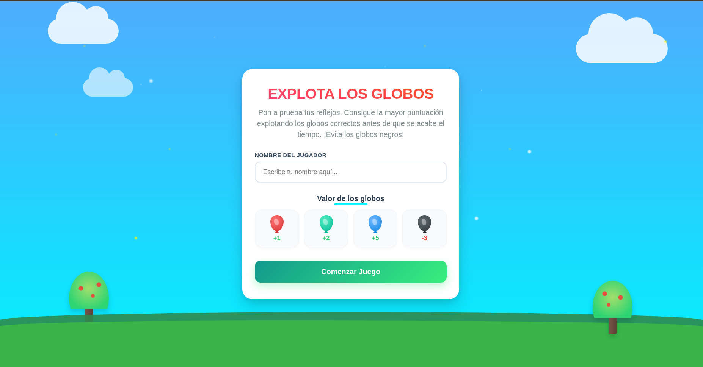
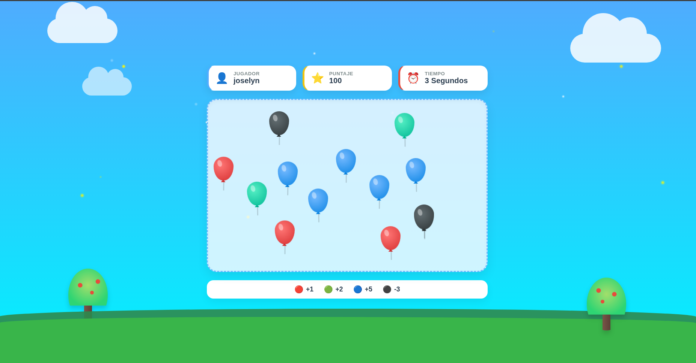
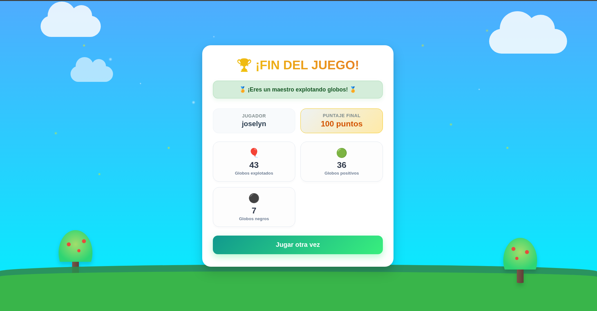

# 🎈 Explota Globos

Un juego desarrollado con **React** donde el jugador debe explotar globos de diferentes colores para conseguir la mayor cantidad de puntos antes de que el tiempo termine.

---

## 👤 Estudiante

**Joselyn Guitz**

---

# 📖 Descripción

Explota Globos es un juego interactivo desarrollado como práctica de React. El jugador debe ingresar su nombre para comenzar la partida y explotar la mayor cantidad de globos posible antes de que finalice el temporizador.

Cada globo tiene un valor diferente dependiendo de su color:

| Globo | Puntaje |
|:------:|:-------:|
| 🔴 Rojo | +1 |
| 🟢 Verde | +2 |
| 🔵 Azul | +5 |
| ⚫ Negro | -3 |

Los globos aparecen de forma aleatoria en distintas posiciones del área de juego y desaparecen automáticamente después de unos segundos si no son explotados.

Al finalizar el tiempo, el juego muestra un resumen con el puntaje obtenido y las estadísticas de la partida.

---

## 🚀 Demostración en Vivo
Puedes jugar directamente en tu navegador accediendo aquí:  
👉 [https://josstech-boop.github.io/Juego_explota_globos_React](https://josstech-boop.github.io/Juego_explota_globos_React)

----

# 🖼 Capturas del proyecto

## Pantalla de inicio



Pantalla donde el jugador ingresa su nombre y conoce el valor de cada tipo de globo antes de comenzar la partida.

---

## Pantalla de juego



Durante 30 segundos aparecen globos de distintos colores en posiciones aleatorias. El jugador debe explotarlos para obtener la mayor puntuación posible.

---

## Pantalla final



Al terminar el tiempo se muestran las estadísticas del jugador, el puntaje final y la opción para volver a jugar.

---

# ⚛️ Conceptos de React utilizados

Durante el desarrollo del proyecto se aplicaron diversos conceptos fundamentales de React:

- Componentes funcionales.
- JSX.
- Props.
- Renderizado condicional.
- Renderizado de listas utilizando `map()`.
- Manejo de eventos (`onClick`).
- Estado mediante `useState`.
- Efectos con `useEffect`.
- Context API.
- Hook `useContext`.
- Funciones actualizadoras del estado.
- Uso de `key` para listas dinámicas.
- Comunicación entre componentes mediante Context.

---

# 🌐 Uso de Context API

Se utilizó **Context API** para compartir el estado global del juego entre todos los componentes sin necesidad de enviar propiedades manualmente.

Dentro del contexto se almacenan:

- Nombre del jugador.
- Pantalla actual.
- Puntaje.
- Temporizador.
- Estadísticas de la partida.
- Lista de globos generados.
- Funciones para crear y eliminar globos.
- Reinicio del juego.

Gracias a Context API cualquier componente puede acceder a esta información mediante `useContext`, logrando un código más limpio y organizado.

---

# 💡 Dificultades encontradas

La parte más compleja del desarrollo fue comprender el funcionamiento de **useEffect** al trabajar con temporizadores y la generación dinámica de globos.

Los principales retos fueron:

- Implementar correctamente el temporizador utilizando `setInterval`.
- Evitar que React creara múltiples intervalos al volver a renderizar el componente.
- Detener la generación de globos cuando el juego finalizaba.
- Generar posiciones aleatorias sin repetir la ubicación de otro globo.
- Crear identificadores únicos (`key`) para cada globo generado dinámicamente.

---

# ✅ ¿Cómo resolví esas dificultades?

Para resolver estos problemas dividí la lógica del juego utilizando distintos `useEffect`.

El primer efecto controla el temporizador del juego y disminuye el tiempo cada segundo utilizando `setInterval`.

El segundo efecto se encarga de generar globos cada cierto tiempo únicamente mientras la pantalla activa es la del juego.

Para evitar errores se utilizaron funciones de limpieza (`clearInterval`) dentro del `return` de cada `useEffect`, impidiendo que existieran múltiples intervalos ejecutándose al mismo tiempo.

También implementé una validación antes de agregar un nuevo globo para comprobar que la posición elegida no estuviera ocupada por otro globo. De esta forma nunca aparecen dos globos en la misma ubicación.

Finalmente, cada globo recibe un identificador único generado con `Date.now()` combinado con un número aleatorio, lo que permite que React renderice correctamente cada elemento utilizando la propiedad `key`.

---

# 🛠 Tecnologías utilizadas

- React 19
- JavaScript ES6
- HTML5
- CSS3
- Vite

---

# ▶️ Instalación

Clonar el repositorio

```bash
git clone https://github.com/josstech-boop/Juego_explota_globos_React.git
```

Entrar al proyecto

```bash
cd juego_infantil
```

Instalar dependencias

```bash
npm install
```

Ejecutar el proyecto

```bash
npm run dev
```

---

# 📁 Estructura del proyecto

```
src
│
├── Final
├── Globos
├── JugadorContext
├── Login
├── MensajeError
├── PantallaDinamica
├── PantallaJuego
├── assets
└── main.jsx
```

---

# 🚀 Posibles mejoras

- Agregar efectos de sonido.
- Animaciones de explosión al hacer clic en los globos.
- Niveles de dificultad.
- Tabla de mejores puntajes.
- Guardar récords utilizando LocalStorage.
- Agregar más tipos de globos y bonificaciones.

---

# 👩‍💻 Autor

**Joselyn Guitz**

Proyecto desarrollado como práctica de React utilizando Hooks y Context API.